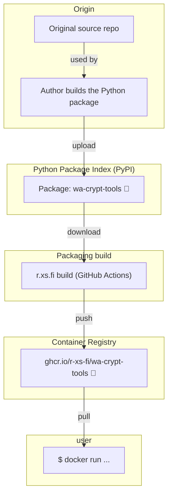

Container image for wa-crypt-tools - decrypt WhatsApp database.

## Usage

### Decrypt WhatsApp database

```shell
read -s backup_encryption_key
docker run --rm -it --volume="$(pwd)":/workspace ghcr.io/r-xs-fi/wa-crypt-tools "$backup_encryption_key" msgstore.db.crypt15
```

Outputs:
```console
keyfactory.py:46        : [I] The keyfile could not be opened.
key15.py:54     : [I] Crypt15 / Raw key loaded
wadecrypt.py:271        : [I] Done
```

Tips:

- Decrypted database will be written to `msgstore.db` (the `.crypt15` from your input argument stripped out)
- You can then open the database with `$ sqlite3 msgstore.db` for example
- Entire process: https://bsky.app/profile/joonas.fi/post/3mtg4svza422o


## Supported platforms


| OS    | Architecture  | Supported | Example hardware |
|-------|---------------|-----------|-------------|
| Linux | amd64 | ✅       | Regular PCs (also known as x64-64) |
| Linux | arm64 | ✅       | Raspberry Pi with 64-bit OS, other single-board computers, Apple M1 etc. |
| Linux | arm/v7 | ❌ (Failed to build pycryptodomex (No such file or directory: 'cc'))       | Raspberry Pi with 32-bit OS, older phones |
| Linux | riscv64 | ❌ (Failed to build pycryptodomex (No such file or directory: 'cc'))       | More exotic hardware |

## How does this software get to me?


